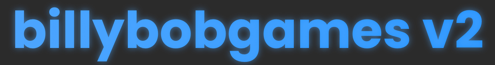

  

# billybobgames v2

This is a recreation of the now-defunct **billybobgames.github.io**.  
It’s maintained specifically to function reliably at my school throughout the school year.
If anyone not from my school is seeing this, yes I know the password system is extremely weak. It is only meant to keep out the dumbahh opps. I will get a better security system if they find it out. (im just too lazy to do it in the first place lmao)

---

## ✅ Project Goals

- 🌐 **Fully Functional Proxy:**  
  Figure out how to make the game cards directly link to a link on the proxy

---

## 🙏 Credits

- **MonkeyGG2**  
  For inspiring the styling of the site and giving me the idea for the bypass system.

- **My Dad**  
  For standing up for me when gramma said it was a terrible idea

- **ChatGPT**  
  For basically making the entire backend and helping me learn some stuff about web design

  
**My Gramma** (click to expand)

 for telling me this was a terrible idea and that i would get suspended. thanks for the motivation 💀

   

    
  

